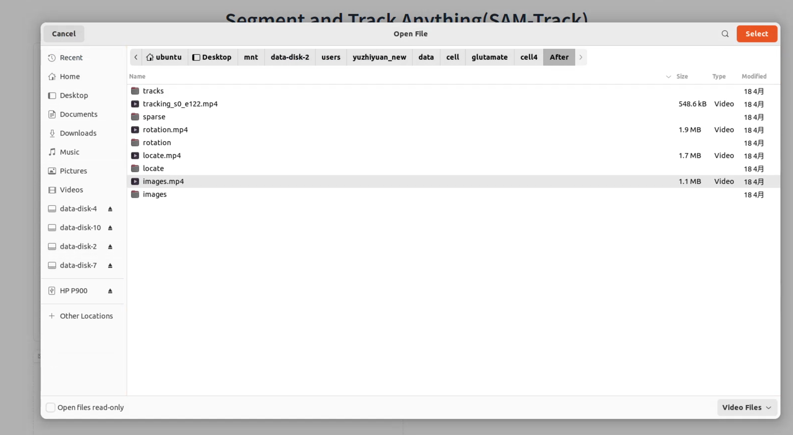
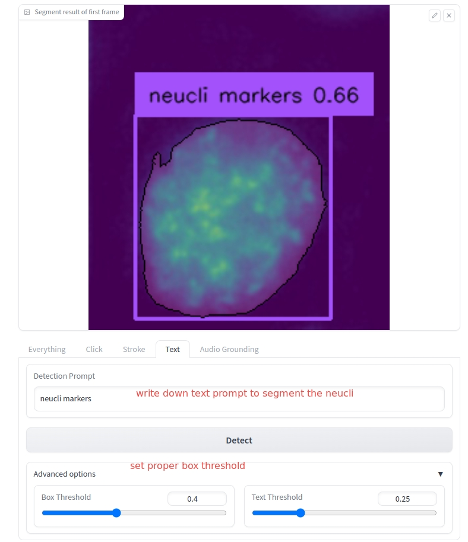
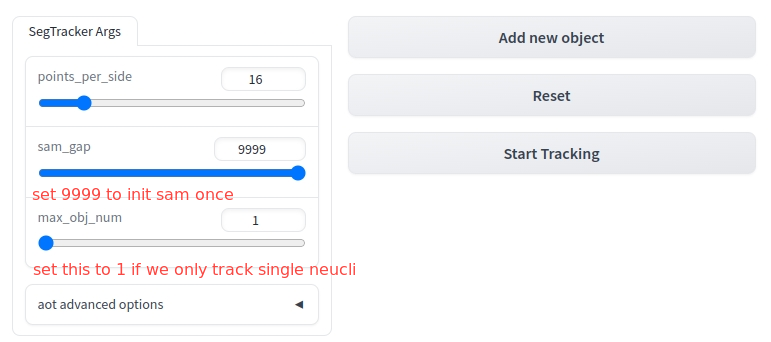
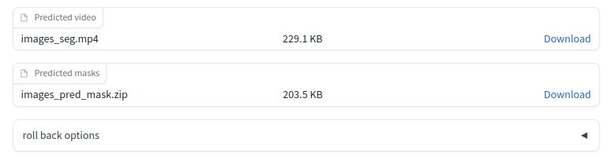

### Install
```shell
bash script/install.sh
```
### Usage
1. run app
```python
python3 app.py
```
2. open http://0.0.0.0:23333
3. click video input
    
4. segment first frame
   we have many ways to segment frist frame. Here shows the text-based segmentation.
    
5. click **start trakcing** and wait for the resutls
    
6. download results (zip file)
    
### Repo Strcutre
```shell
.
├── aot
│   ├── configs
│   │   ├── default.py
│   │   ├── models
│   │   ├── pre_dav.py
│   │   ├── pre.py
│   │   ├── pre_ytb_dav.py
│   │   ├── pre_ytb.py
│   │   ├── __pycache__
│   │   └── ytb.py
│   ├── dataloaders
│   │   ├── eval_datasets.py
│   │   ├── image_transforms.py
│   │   ├── __init__.py
│   │   ├── __pycache__
│   │   ├── train_datasets.py
│   │   └── video_transforms.py
│   ├── datasets
│   │   ├── DAVIS
│   │   ├── Static
│   │   └── YTB
│   ├── __init__.py
│   ├── LICENSE
│   ├── MODEL_ZOO.md
│   ├── networks
│   │   ├── decoders
│   │   ├── encoders
│   │   ├── engines
│   │   ├── __init__.py
│   │   ├── layers
│   │   ├── managers
│   │   ├── models
│   │   └── __pycache__
│   ├── pretrain_models
│   │   └── README.md
│   ├── __pycache__
│   │   └── __init__.cpython-310.pyc
│   ├── README.md
│   ├── source
│   │   ├── overview_deaot.png
│   │   └── overview.png
│   ├── tools
│   │   ├── demo.py
│   │   ├── eval.py
│   │   └── train.py
│   ├── train_eval.sh
│   └── utils
│       ├── checkpoint.py
│       ├── cp_ckpt.py
│       ├── ema.py
│       ├── eval.py
│       ├── image.py
│       ├── __init__.py
│       ├── learning.py
│       ├── math.py
│       ├── meters.py
│       ├── metric.py
│       └── __pycache__
├── aot_tracker.py
├── app.py
├── assets
│   ├── 000000
│   ├── blackswan.mp4
│   ├── cars.mp4
│   ├── cell.mp4
│   ├── demo_3x2.gif
│   ├── gradio.jpg
│   ├── images
│   ├── interactive_webui.jpg
│   ├── md
│   │   ├── image.png
│   │   ├── openvideo.png
│   │   ├── results.jpg
│   │   ├── segmentfirst.jpg
│   │   └── tracking.png
│   └── top.gif
├── ast_master
│   ├── ast
│   │   └── pretrained_models
│   ├── ast.png
│   ├── colab
│   │   ├── AST_Inference_Demo.ipynb
│   │   └── torchaudio_SpecMasking_1_1.ipynb
│   ├── egs
│   │   ├── audioset
│   │   ├── esc50
│   │   └── speechcommands
│   ├── LICENSE
│   ├── prepare.py
│   ├── pretrained_models
│   │   └── audioset_0.4593.pth
│   ├── __pycache__
│   │   └── prepare.cpython-310.pyc
│   ├── README.md
│   ├── requirements.txt
│   └── src
│       ├── dataloader.py
│       ├── demo.py
│       ├── get_norm_stats.py
│       ├── models
│       ├── __pycache__
│       ├── run.py
│       ├── traintest.py
│       └── utilities
├── ckpt
│   ├── groundingdino_swint_ogc.pth
│   ├── R50_DeAOTL_PRE_YTB_DAV.pth
│   └── sam_vit_b_01ec64.pth
├── demo_instseg.ipynb
├── demo.ipynb
├── img2vid.py
├── img_logs
├── licenses.md
├── LICENSE.txt
├── model_args.py
├── prepare.py
├── __pycache__
│   ├── aot_tracker.cpython-310.pyc
│   ├── model_args.cpython-310.pyc
│   ├── seg_track_anything.cpython-310.pyc
│   └── SegTracker.cpython-310.pyc
├── Pytorch-Correlation-extension
│   ├── benchmark.py
│   ├── build
│   │   ├── lib.linux-x86_64-cpython-310
│   │   └── temp.linux-x86_64-cpython-310
│   ├── check.py
│   ├── Correlation_Module
│   │   ├── correlation.cpp
│   │   ├── correlation_cuda_kernel.cu
│   │   ├── correlation_sampler.cpp
│   │   ├── spatial_correlation_sampler
│   │   ├── spatial_correlation_sampler_backend.cpython-310-x86_64-linux-gnu.so
│   │   └── spatial_correlation_sampler.egg-info
│   ├── grad_check.py
│   ├── LICENSE
│   ├── README.md
│   ├── requirements.txt
│   ├── setup_cpu.py
│   └── setup.py
├── README.md
├── README-SEGMENT-TRACKING.md
├── result
│   └── PRE_YTB_DAV_R50_DeAOTL
│       └── PRE_YTB_DAV
├── results
├── sam
│   ├── assets
│   │   ├── masks1.png
│   │   ├── masks2.jpg
│   │   ├── model_diagram.png
│   │   ├── notebook1.png
│   │   └── notebook2.png
│   ├── CODE_OF_CONDUCT.md
│   ├── CONTRIBUTING.md
│   ├── __init__.py
│   ├── LICENSE
│   ├── linter.sh
│   ├── notebooks
│   │   ├── automatic_mask_generator_example.ipynb
│   │   ├── images
│   │   ├── onnx_model_example.ipynb
│   │   └── predictor_example.ipynb
│   ├── __pycache__
│   │   └── __init__.cpython-310.pyc
│   ├── README.md
│   ├── scripts
│   │   ├── amg.py
│   │   └── export_onnx_model.py
│   ├── segment_anything
│   │   ├── automatic_mask_generator.py
│   │   ├── build_sam.py
│   │   ├── __init__.py
│   │   ├── modeling
│   │   ├── predictor.py
│   │   ├── __pycache__
│   │   └── utils
│   ├── segment_anything.egg-info
│   │   ├── dependency_links.txt
│   │   ├── PKG-INFO
│   │   ├── requires.txt
│   │   ├── SOURCES.txt
│   │   └── top_level.txt
│   ├── setup.cfg
│   └── setup.py
├── script
│   ├── download_ckpt.sh
│   └── install.sh
├── seg_track_anything.py
├── SegTracker.py
├── src
│   └── groundingdino
│       ├── build
│       ├── demo
│       ├── Dockerfile
│       ├── docker_test.py
│       ├── environment.yaml
│       ├── groundingdino
│       ├── groundingdino.egg-info
│       ├── LICENSE
│       ├── README.md
│       ├── requirements.txt
│       ├── setup.py
│       └── test.ipynb
├── structure
├── tool
│   ├── detector.py
│   ├── __pycache__
│   │   ├── detector.cpython-310.pyc
│   │   ├── segmentor.cpython-310.pyc
│   │   └── transfer_tools.cpython-310.pyc
│   ├── segmentor.py
│   └── transfer_tools.py
├── tracking_results
└── tutorial
    ├── img
    │   ├── add_positive_base_on_everything_cxk.jpg
    │   ├── add_positive_base_on_everything.jpg
    │   ├── add_positive_points_2.jpg
    │   ├── add_positive_points.jpg
    │   ├── audio_tab.jpg
    │   ├── click_input_video.jpg
    │   ├── click_segment_everything.jpg
    │   ├── click_segment.jpg
    │   ├── detect_result.jpg
    │   ├── Drawing_board.jpg
    │   ├── enter_text.jpg
    │   ├── grounding-tab.jpg
    │   ├── input_video.jpg
    │   ├── new_object.jpg
    │   ├── second_object.jpg
    │   ├── segment_everything_blackswan.jpg
    │   ├── select_fps.jpg
    │   ├── start_tracking.jpg
    │   ├── switch2ImgSeq.jpg
    │   ├── switch2textT.jpg
    │   ├── upload_Image_seq.jpg
    │   └── use_exa4ImgSeq.jpg
    ├── tutorial for Image-Sequence input.md
    ├── tutorial for WebUI-1.0-Version.md
    ├── tutorial for WebUI-1.5-Version.md
    └── tutorial for WebUI-1.6-Version.md
```
